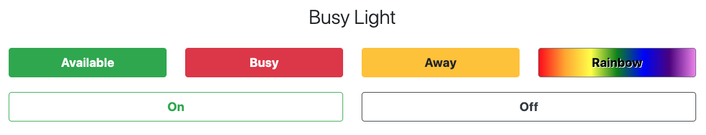

# Simple server for Raspberry Pi with Pimoroni Unicorn hat

* [Introduction](#Introduction)
* [Installation](#Installation)
* [Usage](#Usage)
    * [Set the unicorn to On](#on)
    * [Set the unicorn to Off](#off)
    * [Get the server Status](#status)
    * [Set unicorn to show a Rainbow](#rainbow)
    * [Set unicorn to a colour using RGB](#rgb)
    * [Set unicorn to available](#available)
    * [Set unicorn to busy](#busy)
    * [Set unicorn to away](#away)
    * [Reset the overwritten status](#reset)
* [Todo](#Todo)
* [License](#License)

# Introduction

This is a project to create a busy light from both the Pimoroni [Unicorn Phat](https://shop.pimoroni.com/products/unicorn-phat) and [Unicorn Mini](https://shop.pimoroni.com/products/unicorn-hat-mini).

The service itself has the following features:

* Installation script to simplify the process
* APIs for turning the Unicorn on/off
* APIs for changing the colors
* Rainbow effect
* Front-end to show the current status and manually set its status

# Installation

In order to install this on your Raspberry Pi, you can follow the next steps:

Copy and paste the following in to a terminal. It will install all the required files, enable, and start the service.  If you are running Raspbian or Ubuntu, you can use the following installation command:

```bash
curl -LSs https://raw.githubusercontent.com/estruyf/unicorn-busy-server/master/install.sh | sudo bash -
```

If there might be a trust issue while running the command, you could try the following:

```bash
cd /tmp
curl -LSs https://raw.githubusercontent.com/estruyf/unicorn-busy-server/master/install.sh
cat install | more # So you can see the contents of the script a page at time
sudo bash ./install.sh -V -i /home/pi/unicorn-busy-server
```

> **Important**: Currently the script only runs on Raspbian/Ubuntu. Feel free to submit a pull request to extend the PR to support other distributions. Or you can make use of the old installation script: `install-fallback.sh`.

If you want to clone/fork this repo and carry on development on a more sensible machine, you can install the required files without needing to install the service by doing the following:

```bash
curl -LSs https://raw.githubusercontent.com/estruyf/unicorn-busy-server/master/install.sh
bash ./install.sh -d
```

The scripts usage output is as follows:

```
Unicorn Busy Server installation script 0.5
(c) Jamie Maynard 2020

Usage:
  -i  --install-dir        Specify where you want to install to
                           Default is: /home/pi/Development/unicorn-busy-server
  -d  --development        Install for development only (no service installation)
  -V  --verbose            Shows command output for debugging
  -v  --version            Shows version details
  -h  --help               Shows this usage message
```

# Usage

If you've run the install script (without the -d option) check the Unicorn hat attache to your Pi.  If all has gone according to plan the unicorn hat will be changing colours.  Once its going through all 360 Hues within the HSV spectrum it'll go blank.  As soon as the Uniron hat lights up the `Busylight Server` is ready to start receiving commands.

The front-end is available via `http://<your-ip>:5000/`.



The API is fairly simple though has been extend quite a bit from its orignal implementation.  The Busy server has the following API endpoing:

| Method                                                    | Endpoint                     | Description                                                          |
|:---------------------------------------------------------:|------------------------------|----------------------------------------------------------------------|
| [<span style="color: blue">**GET**</span> <span style="color: green">**POST**</span>](#on)           | [`/api/on`](#on)             | Turn the Unicorn Hat on to a random colour                           |
| [<span style="color: blue">**GET**</span> <span style="color: green">**POST**</span>](#off)          | [`/api/off`](#off)           | Turn the Unicorn Hat off                                             |
| [<span style="color: blue">**GET**</span>](#status)       | [`/api/status`](#status)     | Get the status of the Unicorn Hat/Pi                                 |
| [<span style="color: green">**POST**</span>](#rainbow)    | [`/api/rainbow`](#rainbow)   | Set the unicorn to cycle through all 360 hues in the HSV spectrum    |
| [<span style="color: green">**POST**</span>](#rgb)        | [`/api/switch`](#rgb)        | Set the unicorn to a specific colour using RGB Integer values        |
| [<span style="color: blue">**GET**</span> <span style="color: green">**POST**</span>](#available)  | [`/api/available`](#available)  | Set the unicorn to the `available` status color. This overwrites the status. Call [`/api/switch`](#reset) to turn off.  |
| [<span style="color: blue">**GET**</span> <span style="color: green">**POST**</span>](#busy)       | [`/api/busy`](#busy)       | Set the unicorn to the `busy` status color. This overwrites the status. Call [`/api/switch`](#reset) to turn off.  |
| [<span style="color: blue">**GET**</span> <span style="color: green">**POST**</span>](#away)       | [`/api/away`](#away)       | Set the unicorn to the `away` status color. This overwrites the status. Call [`/api/switch`](#reset) to turn off.  |
| [<span style="color: blue">**GET**</span> <span style="color: green">**POST**</span>](#reset)      | [`/api/reset`](#reset)      | Resets the status overwrite setting. This way, the [`/api/switch`](#rgb) can be called again. |

## <a id="on"></a> Set the Unicorn to On

| Method                                      | Endpoint  |
|:-------------------------------------------:|-----------|
| <span style="color: blue">**GET**</span> <span style="color: green">**POST**</span>    | `/api/on` |

### Description

The simpelest method there is.  It turns the Unicorn Hat on to a random colour.

### Result

Returns `200 OK` and an Empty JSON Object `{}`

## <a id="off"></a> Set the Unicorn to Off

| Method                                      | Endpoint   |
|:-------------------------------------------:|------------|
| <span style="color: blue">**GET**</span> <span style="color: green">**POST**</span>    | `/api/off` |

### Description

Another really simple method.  This Turns the Unicorn Hat off.

### Result

Returns `200 OK` and an Empty JSON Object `{}`

## <a id="status"></a> Get the server Status

| Method                                      | Endpoint      |
|:-------------------------------------------:|---------------|
| <span style="color: blue">**GET**</span>    | `/api/status` |

### Description

Get the status of the pi

### Result

Returns `200 OK` and the following JSON Object:

```json
{
  "blue": 110,
  "brightness": 0.5,
  "cpuTemp": 39.546,
  "green": 60,
  "height": 8,
  "icon": "none",
  "lastCalled": "Sun, 17 May 2020 18:00:33 GMT",
  "lastCalledApi": "/api/on",
  "red": 247,
  "unicorn": "phat",
  "width": 4
}
```

## <a id="rainbow"></a> Set Unicorn to show a Rainbow

| Method                                       | Endpoint        |
|:--------------------------------------------:|-----------------|
| <span style="color: green">**POST**</span>   | `/api/rainbow`  |

### Description

This method was build off the back of an HSV method in the UnicornWrapper class.  You can step horizontally across the HSV spectrum from 0 to 360 this allows you to cycle through all colours of a spectrum.  It is similar to Razer Synpases "Spectrum" effect.  It makes a nice Unicorn when you're not doing anything and can be helpful for making sure your Unicorn Phat/Mini is setup correctly.

### Request

All values are optional in this request so its possible to send a request like the one below and still have the rainbow effect activate.

```json
{}
```

However you can customise your rainbow first by specifying the starting `hue`.  This is an integer between `0` and `360`.  The default is `0` which is Red.

You can specify your `step` through the hue range.  This again can be any number between `1` and `90`  The bigger the number the greater the change between between transitioning colours.  Smaller numbers result in a much smooter transition.  The default is `1`.

You can specify the transition `speed`, that is the speed at which the colours change.  This is any number in seconds the smaller the number the quicker the change the quicker you cycle through the hue spectrum.  The default is `0.2`

Finally you can specify the `brightness` this is any floating point number between `0` and `1`.  The default is `0.5`.

Example request JSON:


```jsonc
{
    "brightness": 0.5,      // Optional
    "speed": 1              // Optional
}
```

### Result

Returns `200 OK` and an Empty JSON Object `{}`

## <a id="rgb"></a> Set Unicorn to a colour using RGB

| Method                                       | Endpoint       |
|:--------------------------------------------:|----------------|
| <span style="color: green">**POST**</span>   | `/api/switch`  |

### Description

This is the original RGB method for setting the Unicorn to a single colour.

### Request

You have to specify the vaules for `red`, `green` and `blue`.  These are integers between `0` and `255`.

Optionally you can specify the brightness of the Unicorn.  This is a float value between 0 and 1.  The default is set to 0.5.

Optionally you can also specify the blink speed.  This specifies the speed in seconds which the Unicorn turns on and off.

```jsonc
{
    "red":0,
    "green":255,
    "blue":0,
    "brightness": 0.5,      // Optional
    "speed": 1              // Optional
}
```

### Result

Returns `200 OK` and an Empty JSON Object `{}`


## <a id="available"></a> Set the Unicorn to available

| Method                                      | Endpoint  |
|:-------------------------------------------:|-----------|
| <span style="color: blue">**GET**</span> <span style="color: blue">**POST**</span>    | `/api/available` |

### Description

Overrides the status to `available`. This way, any call coming in to the [`/api/switch`](#rgb) endpoint will be ignored. You will have to call the [`/api/reset`](#reset) endpoint in order to remove the override.

### Result

Returns `200 OK` and an Empty JSON Object `{}`


## <a id="busy"></a> Set the Unicorn to busy

| Method                                      | Endpoint  |
|:-------------------------------------------:|-----------|
| <span style="color: blue">**GET**</span> <span style="color: blue">**POST**</span>    | `/api/busy` |

### Description

Overrides the status to `busy`. This way, any call coming in to the [`/api/switch`](#rgb) endpoint will be ignored. You will have to call the [`/api/reset`](#reset) endpoint in order to remove the override.

### Result

Returns `200 OK` and an Empty JSON Object `{}`


## <a id="away"></a> Set the Unicorn to away

| Method                                      | Endpoint  |
|:-------------------------------------------:|-----------|
| <span style="color: blue">**GET**</span> <span style="color: blue">**POST**</span>    | `/api/away` |

### Description

Overrides the status to `away`. This way, any call coming in to the [`/api/switch`](#rgb) endpoint will be ignored. You will have to call the [`/api/reset`](#reset) endpoint in order to remove the override.

### Result

Returns `200 OK` and an Empty JSON Object `{}`


## <a id="reset"></a> Set the Unicorn to reset

| Method                                      | Endpoint  |
|:-------------------------------------------:|-----------|
| <span style="color: blue">**GET**</span> <span style="color: blue">**POST**</span>    | `/api/reset` |

### Description

Resets the status override state so that the [`/api/switch`](#rgb) endpoint will not ignore color/status changes.

### Result

Returns `200 OK` and an Empty JSON Object `{}`


# Todo

- [ ] Add support for the [Unicorn Hat](https://shop.pimoroni.com/products/unicorn-hat)
- [x] Add front-end

# License

**MIT License**

Copyright (c) 2020 [*Elio Struyf*](https://github.com/estruyf)
Parts (c) 2020 [*Jamie Maynard*](https://github.com/j-maynard)

Permission is hereby granted, free of charge, to any person obtaining a copy of this software and associated documentation files (the "Software"), to deal in the Software without restriction, including without limitation the rights to use, copy, modify, merge, publish, distribute, sublicense, and/or sell copies of the Software, and to permit persons to whom the Software is furnished to do so, subject to the following conditions:

The above copyright notice and this permission notice shall be included in all copies or substantial portions of the Software.

THE SOFTWARE IS PROVIDED "AS IS", WITHOUT WARRANTY OF ANY KIND, EXPRESS OR IMPLIED, INCLUDING BUT NOT LIMITED TO THE WARRANTIES OF MERCHANTABILITY, FITNESS FOR A PARTICULAR PURPOSE AND NONINFRINGEMENT. IN NO EVENT SHALL THE AUTHORS OR COPYRIGHT HOLDERS BE LIABLE FOR ANY CLAIM, DAMAGES OR OTHER LIABILITY, WHETHER IN AN ACTION OF CONTRACT, TORT OR OTHERWISE, ARISING FROM, OUT OF OR IN CONNECTION WITH THE SOFTWARE OR THE USE OR OTHER DEALINGS IN THE SOFTWARE.
